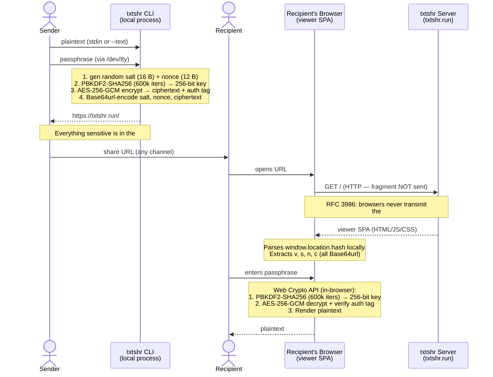

# txtshr

Share sensitive text securely. The CLI encrypts your text and gives you a URL — the recipient opens it in their browser and decrypts it with a passphrase you share separately.

**The server never sees your text or passphrase.** Everything sensitive lives in the URL fragment (`#`), which browsers never transmit. Encryption and decryption happen entirely on your machine and in their browser.

**URLs never expire.** The encrypted payload is self-contained in the URL — there is no server-side storage to delete. Once generated, a link works forever.

## Install

```bash
brew tap aren55555/tap
brew install txtshr
```

## Usage

```bash
# Pipe text in — prompts for a passphrase
echo "secret message" | txtshr

# From a file
cat secret.txt | txtshr

# Inline
txtshr --text "secret message"
```

You'll get back a URL like `https://txtshr.run/#...`. Send it to whoever needs it, then share the passphrase separately (Signal, in person, etc.).

The recipient opens the URL, enters the passphrase, and sees the plaintext — no account, no app, just a browser.

## How it works

1. Your text is encrypted locally with AES-256-GCM, using a key derived from your passphrase via PBKDF2-SHA256 (600,000 iterations)
2. The encrypted payload is encoded into the URL fragment
3. The recipient's browser decrypts it locally using the Web Crypto API — nothing is sent to the server



## Self-hosting the viewer

The viewer at [txtshr.run](https://txtshr.run) is available for anyone to use. If you'd prefer to host it yourself:

```bash
docker run -p 8080:80 aren55555/txtshr:latest
```

Then point the CLI at your instance:

```bash
TXTSHR_VIEWER_URL=https://your-viewer.example.com txtshr --text "hello"
```
