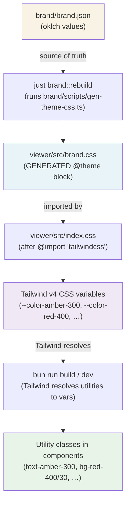

# txtshr viewer

The browser-side decryption viewer for [txtshr](../README.md), built with
Solid.js + Vite + Tailwind CSS v4, using **Bun** as the package manager and
runtime.

```bash
bun install
bun run dev       # dev server (Vite, http://localhost:5173)
bun run build     # production bundle → dist/
bun run preview   # preview the production build
bun test          # unit tests
```

## Theming — where colors come from

The viewer never defines color values itself. Every color flows from a single
source of truth, `brand/brand.json`, through a generated Tailwind theme:



Key properties:

- **Token names match Tailwind's palette** (`amber-300`, `slate-950`, …), so
  components use ordinary Tailwind utilities — but the generated `@theme`
  block *overrides* Tailwind's default values, so `brand.json` wins whenever
  they differ.
- **`viewer/src/brand.css` is generated — do not edit it.** Edit
  `brand/brand.json` and regenerate.
- Components must only use tokens declared in `brand.json`.
  `src/components/Toast.test.ts` enforces this for the toast palettes by
  importing `brand.json` and checking every token it uses.

### Refreshing colors

After changing a color in `brand/brand.json`:

```bash
just brand::rebuild    # regenerates ALL brand outputs, including viewer/src/brand.css
```

`rebuild` also regenerates the brand reference page, `icon.svg`, favicon and
app icon PNGs, splash screens, and the feature graphic — everything derived
from `brand.json` — so a color change propagates to every surface at once.
All outputs are reproducible: `git diff` is clean after a rebuild on any
machine, and generated files are committed.

To regenerate only the viewer theme (faster, skips icon rasterisation):

```bash
cd brand/scripts && bun run gen-theme-css.ts
```

The dev server picks the change up via HMR; a production bundle needs a
fresh `bun run build`.

## Component gallery

The viewer's Solid components (Toast, Card, Spinner, RendererSelect, …) can
be browsed in isolation, in all their states, via the gallery app in
[`gallery/`](../gallery/):

```bash
just gallery::dev       # dev server (Vite picks a port, e.g. :5174)
just gallery::build     # production build → gallery/dist
just gallery::preview   # serve the production build
```

The gallery renders the viewer's *actual* components — its Vite config
aliases `@viewer` to `viewer/src`, and it imports `viewer/src/index.css`, so
it shares this app's Tailwind pipeline and the generated brand theme. There
is nothing to keep in sync: a component or `brand.json` change shows up in
the gallery on the next reload.
